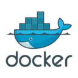

# Exchange platform

A Microservice platform formed by two micro-services:

*  **Conversion_service:** Entry point of the platform. Receive the request to obtain the currency echange from
one currency to another.
   
* **Currency_exchange_service:** Inner server of the platform that the **Conversion_service** invoke to make the calc 
between currencies.


## Technology

* For the Rest API and Rest connector I use [Finagle](https://twitter.github.io/finagle/) which provide the possibility
  to use the reactive features:
  * **Async request** Running the computation in another thread.
  * **Retry strategy:** To handle error in communications and retry with a specific strategy
  * **Circuit breaker:** A fail fast feature, to control that when a server is down, after apply 
    the retry strategy close the communication until it detects the server is responding again.
  * **Observability:**  To add a monitoring which it subscribe to error in communications, to allow us
    make some strategies in case we need.
  

* To control all possible side effects in our program I use Effect system [ZIO](https://zio.dev), a pure functional programing toolkit
  which provide the features to have Pure functional programs with side effect control,
  lazy evaluation, performance improvements since the program run in Fibers(Green threads) instead in OS Threads, and also DI mechanism with ZLayers.


## Testing


**To go fast you have to go well** this quote of Robert C. Martin express perfectly what TDD and BDD is about. You should think first in all corner cases of your program, and then implement
one by one committing every scenario to have a quick feedback about your program.

In my application I invested around 70% of the time implementing the test framework, the type of testing implemented are described below.

* **Unit**: I used [scalatest](https://www.scalatest.org) together with some local mocks to Mock external resources of your class.
* **Integration**: I create the **test-framework** module with dependencies of both modules to test the end to end of the platform.
 
  Just to be clear, the Integration test are just a proof that our Unit test are well designed and the Mock behaves as I expect. None IT test should ever fail. And if it does,
  you have to reproduce it in Unit test.

## How to run

There's two ways to build and run ```Exchange platform``` by **Docker** or **Makefile**

### Docker

To being able to build and run this project, it will require you have `````Docker deamon````` installed.

Create the docker image, running in the root folder 
````
docker build -t exchange .
````

Once we pass all the test and we build the image, we create a container through the images.

````
docker run -p 9994:9994 exchange
````

To hit the platform you can run a curl like ths one:

````
curl --header "Content-Type: application/json" \
     --request POST \
     --data '{"fromCurrency": "GBR", "toCurrency" : "EUR", "amount" : 102.6}' \
     http://localhost:9994/api/convert/
````

### Makefile

To being able to build and run this project, it will require you have `````sbt````` installed.

I create a **Makefile** to add all the option to interact with the platform:

* **clean:** Clean all the resources in the target folder.
* **test** Run all the testing pyramid   
* **build:** Build the platform and generate Fat jar for each service.
* **run-conversion:** Run the Conversion server.
* **run-currency-exchange:** Run the Currency exchange server.
* **test-request:** Run a Post request against the platform.

````
Makefile clean|build|run-conversion|run-currency-exchange|test-request
````

docker build .
docker scan .

## Stack

  